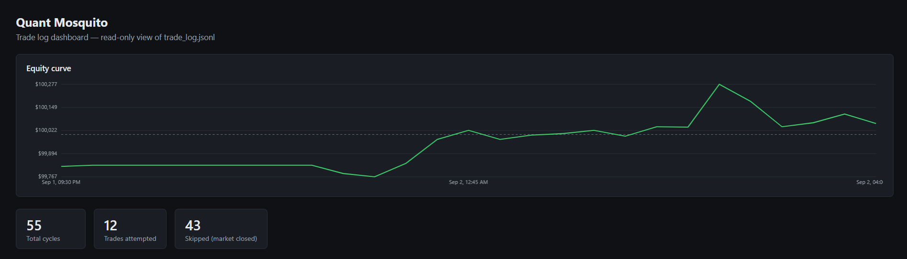
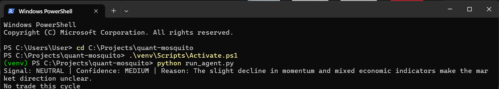
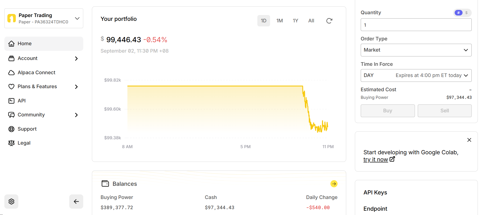
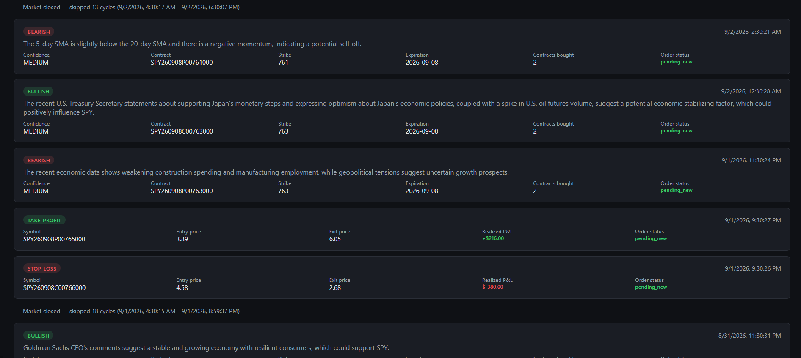
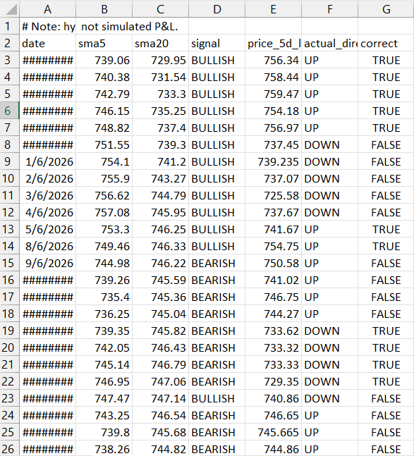

# Quant Mosquito

**An options trading agent that reads the tape *and* the news — not just the tape.**



Most rule-based trading bots react to numbers alone. Quant Mosquito feeds real SPY technical indicators *and* live news headlines to an LLM, lets it reason through both, and only then acts — sizing, entering, managing, and exiting real paper-account option trades on its own schedule.

## Tech stack

The agent loop is plain Python, invoked on a schedule with no long-running process. Each cycle pulls market data and news through Alpaca's Python SDK, hands both to a Featherless-hosted LLM over an OpenAI-compatible chat completion call to get a signal and a confidence level, then — for anything that actually needs to place or close an order — shells out to Alpaca's official CLI rather than the SDK's order-submission methods, so the SDK stays read-only and every state-changing action goes through one auditable, non-Python execution path.

**Language & Runtime**
- Python 3.13 — the agent loop, signal logic, and position management
- `python-dotenv` — loads Alpaca/Featherless credentials from `.env`
- `subprocess` (stdlib) — invokes the Alpaca CLI binary from `position_manager.run_alpaca_cli()`

**Trading & Market Data**
- `alpaca-py` 0.44 (`TradingClient`, `StockHistoricalDataClient`, `OptionHistoricalDataClient`, `NewsClient`) — account state, SPY daily bars, option chain lookups, and news headlines; all read-only
- `pandas` (pulled in via `alpaca-py`'s `.df` accessor) — the DataFrame `get_signal.py` slices to pull closing prices out of bar data
- Alpaca CLI (`tools\alpaca.exe`, official Go binary, downloaded separately — not a Python dependency) — the only thing in this project that submits or closes an order: `order submit` for entries, `position close` for exits, and `doctor` as a pre-flight check that the CLI is actually resolved to the paper endpoint before either runs

**AI/LLM**
- Featherless AI — hosts the model; reached over its OpenAI-compatible API
- `openai` 3.6 (official Python SDK) — the client used to call Featherless, with `base_url` pointed at Featherless instead of OpenAI
- Model: `Qwen/Qwen2.5-7B-Instruct` (set via `FEATHERLESS_MODEL` in `.env`, swappable to anything Featherless hosts)

**Dev tooling**
- None. No test framework — `test_*.py` files are plain `assert`-based scripts using only the standard library (`unittest`-free, no `pytest`).

One correction from your brief: you listed "Alpaca CLI" without specifying its role — in this codebase it's narrowly scoped to order submission, position closes, and the paper-endpoint safety check, nothing else. Market data, account queries, and position listing all go through the SDK.

## Why this is different

- **Reasoning, not just rules.** The signal isn't `if SMA5 > SMA20: buy` — it's an LLM weighing SMA5/SMA20/momentum *alongside real Alpaca news headlines* for the same 3-day window, so a technical crossover can be overridden by "Fed signals rate cut" or confirmed by it.
- **Confidence-scaled position sizing.** The agent doesn't bet the same size on every call — LOW/MEDIUM/HIGH confidence from the LLM directly scales risk from 0.5% to 1.5% of account cash per trade.
- **Manages positions, not just opens them.** Every cycle checks existing holdings for take-profit (+50%), stop-loss (-30%), and time-based exit (≤1 day to expiration) *before* considering any new trade — this isn't a buy-and-forget bot.
- **A daily loss circuit breaker.** If the account is down 5% on the day, new entries halt automatically — but closing an existing losing position is never blocked, because that's exactly when you need it least gated.
- **Two Alpaca tools, used for what each is good at.** The Python SDK handles market data, account state, and read-only queries; the official Alpaca CLI handles the actions that actually move money (order submission, position closes) — a deliberate split, not an accident.
- **A validated technical foundation, not an assumed one.** The SMA-cross signal that feeds the LLM was backtested against 90 days of real SPY history before being trusted — see [Backtest findings](#backtest-findings) below.

## Architecture

**Data → signal → contract selection → position sizing → order → logging**

- **`get_signal.py`** — pulls SPY's last 25 daily bars from Alpaca, computes a 5-day SMA, 20-day SMA, and 5-day momentum, fetches recent SPY news headlines from Alpaca's news API, and sends both the indicators and headlines to the Featherless LLM, parsing back a `SIGNAL` / `CONFIDENCE` / `REASON`.
- **`options_selector.py`** — given a signal, fetches SPY's current price and Alpaca's option chain, filters to calls (bullish) or puts (bearish), and picks the nearest out-of-the-money strike expiring 5–14 days out.
- **`position_manager.py`** — reads open positions and closes any that hit take-profit (+50%), stop-loss (-30%), or are within a day of expiring.
- **`run_agent.py`** — the entry point. Checks the market is open, evaluates the daily loss circuit breaker (tracking the day's starting equity in `daily_state.json`), always runs position-exit logic regardless of the breaker, then — if the breaker hasn't halted new entries — calls `get_signal()`, calls `select_option_contract()`, sizes the position by confidence (capped at $2,000 per trade), submits the order, and appends a JSON record of the whole cycle to `trade_log.jsonl`.

Two Alpaca tools split the work: the **Python SDK** (`alpaca-py`) handles everything read-only — market data, indicators, news, account/clock checks, listing positions. The **Alpaca CLI** (`tools\alpaca.exe`) handles the two actions that actually move money: submitting the entry order and closing a position on exit, via `position_manager.run_alpaca_cli()`. Every order submission passes a fresh `--client-order-id` so a retried run can't double-submit. Before any of that runs, `verify_paper_endpoint()` calls `alpaca doctor` to confirm the CLI is actually resolved to the paper trading endpoint; if it isn't, the entire cycle aborts and logs a `safety_abort` instead of going anywhere near an order, so misconfigured credentials can never result in a live trade.

## Setup

```bash
git clone <this repo>
cd quant-mosquito
python -m venv venv
venv\Scripts\activate
pip install -r requirements.txt
copy .env.example .env
```

Then fill in `.env` with your real Alpaca and Featherless keys. `.env` is gitignored — never commit it.

Order execution also needs the [Alpaca CLI](https://github.com/alpacahq/cli/releases/latest) at `tools\alpaca.exe` (gitignored, download separately — grab the `windows_amd64` zip and extract `alpaca.exe` into `tools\`).

## Running

**Manually:**
```bash
python run_agent.py
```

**Scheduled:** `run_agent.bat` activates the venv, runs the agent, and logs output to `logs\`. Register it with Windows Task Scheduler to run hourly:

```bash
schtasks /create /tn "QuantMosquitoAgent" /tr "C:\Projects\quant-mosquito\run_agent.bat" /sc hourly /mo 1 /st 09:30 /f
```

It's safe to run outside market hours — `run_agent.py` checks Alpaca's clock first and logs a `skipped` cycle instead of trading.



This is really hitting the paper account, not a mock — same account, same positions, visible on Alpaca's own dashboard:



## Dashboard

`dashboard.html` is a static, dependency-free page. It renders an equity curve at the top (portfolio value over time, plotted with plain `<canvas>` — no chart library) followed by a card per cycle from `trade_log.jsonl` (signal, reasoning, contract, order status), newest first, with header counts for total/traded/skipped cycles.

Each card shows signal, confidence, reasoning, and contract details — reasoning that's grounded in real headlines, not just indicator numbers, which is why consecutive cycles can flip between BEARISH and BULLISH as the news changes, not just the SMA cross:



The equity curve reads `portfolio_history.json`, a static snapshot — it does not update live. Re-run this before opening the dashboard to refresh it:

```bash
python export_portfolio_history.py
```

Open `dashboard.html` directly, or if your browser blocks local `fetch()` on `file://` URLs, serve the folder:

```bash
python -m http.server
```

then visit `http://localhost:8000/dashboard.html`.

## Risk management

- Each trade risks a fraction of current account cash based on the LLM's confidence: **0.5%** (LOW), **1%** (MEDIUM), or **1.5%** (HIGH).
- Regardless of that percentage, no single trade risks more than a **$2,000 hard cap**.
- If the risk budget can't afford even one contract but one contract still fits under the $2,000 cap, the agent buys a minimum of 1 contract; if even one contract exceeds the cap, it skips the trade.

**Daily circuit breaker:** each trading day, the agent records its starting equity. If the account is ever down **5%** from that baseline during the day, new entries halt for the rest of the day — no new signal is even generated, so no Featherless calls are wasted on a trade that won't be taken. This never blocks closing existing positions: a stop-loss or take-profit exit still fires normally, since a circuit breaker that traps you in a losing position on the worst day is worse than no circuit breaker at all.

## Backtest findings

Before trusting the SMA-cross logic that feeds into the live signal, it was backtested in isolation via `backtest.py`:

- **What was tested:** the pure technical component only — BULLISH if SMA5 > SMA20, BEARISH if SMA5 < SMA20 — with no LLM and no news, against 90 days of real SPY historical bars. Each call was checked against SPY's actual closing price 5 trading days later.
- **Result:** 65 signals generated, **32.3% overall accuracy** — both the BULLISH (38.1%) and BEARISH (21.7%) breakdowns landed below the 50% random-chance baseline.
- **Honest interpretation:** a raw SMA cross is a lagging indicator — by the time SMA5 crosses SMA20, the move it's flagging has often already happened, so it tends to catch reversals late rather than predict them. On its own, it's not a tradeable edge. That's precisely why the live agent never trades on the SMA cross alone: it's one input the LLM weighs alongside momentum and real news headlines, and the LLM is free to override a weak or stale technical signal rather than follow it blindly. The backtest validates that the technical foundation is honestly weak in isolation — which is the point of layering reasoning on top of it, not a reason to trust the technical signal by itself.



Full day-by-day results are in `backtest_results.csv` for anyone who wants to check the math.

## Limitations & production considerations

This is a hackathon prototype, and it's worth being direct about the gap between what's here and what real capital deployment would require.

- **Paper trading only.** Every trade in this project has run against Alpaca's paper environment. No real capital has been risked, and nothing here has been validated against live execution, real slippage, or real fills.
- **No human in the loop.** There is no confirmation step before an order executes — once the pipeline decides to act, the trade goes out autonomously. That's a deliberate design choice for this prototype, not an oversight, but it's a materially different risk posture than a system where a person reviews each trade.
- **Single-day risk awareness.** The circuit breaker resets its baseline every trading day and only looks at that day's loss. It has no memory of a losing streak spanning multiple days, no concept of a broader drawdown pattern, and no way to recognize that today is the fourth bad day in a row.
- **Non-deterministic reasoning.** The LLM can produce different SIGNAL/CONFIDENCE/REASON output across runs given the same indicators and headlines. That's acceptable for a paper-trading prototype where the worst case is a suboptimal simulated trade, but production use would need tighter behavioral guarantees — bounded output variance, or a fallback when the model's reasoning drifts from expected patterns.
- **What real capital would require beyond this.** Deploying this kind of system with real money would need, at minimum: stricter and multi-tier circuit breakers (not just a single daily threshold), mandatory human review for entries above a defined size, and — depending on the deployment context — regulatory and compliance review. None of that is built here; this project stops at a working, honestly-tested paper-trading prototype.
